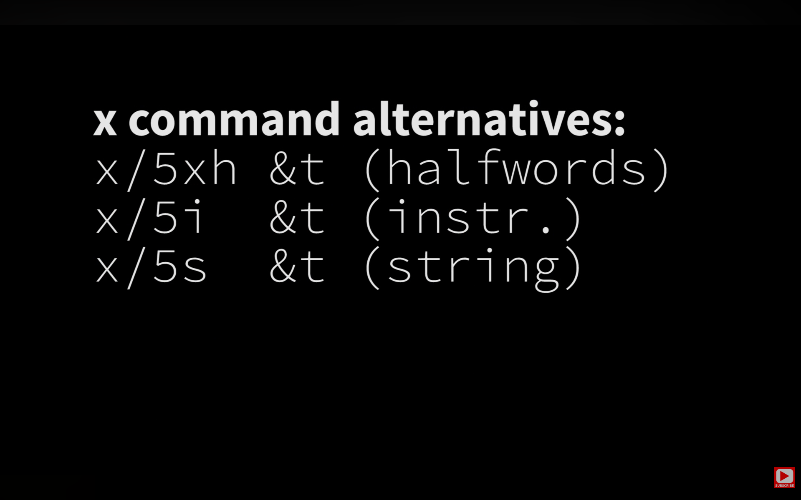

# Debuggers — Notes

- **Author:** Yash Deshpande
- **Date:** 01-08-2026
- **LLM Model:** Claude (Opus 4)

## Sources

| # | Video | Author | Duration |
|---|-------|--------|----------|
| 1 | [Learn GDB in 60 seconds](https://youtu.be/mfmXcbiRs0E?si=OmHf3q55oTmNN0xj) | Jacob Sorber | 1:32 |
| 2 | [How to examine memory in GDB](https://youtu.be/A_pV61xFty8?si=sF4zUq-Y-UG2iL3D) | Jacob Sorber | 1:47 |

## Index

1. [Perils of `printf` debugging](#perils-of-printf-debugging)
2. [What is a debugger?](#what-is-a-debugger)
3. [What a debugger is (and isn't) for](#what-a-debugger-is-and-isnt-for)
4. [Why does gdb require `-g`?](#why-does-gdb-require--g)
5. [How does GDB work?](#how-does-gdb-work)
6. [Gotcha: setting a breakpoint](#gotcha-setting-a-breakpoint)
7. [Challenge: inspect memory — why is `sizeof(struct)` 12? (Jack Sorber)](#challenge-inspect-memory--why-is-sizeofstruct-12-jack-sorber)

## Perils of `printf` debugging

Before reaching for a debugger, most of us start with `printf`. It works — until it
doesn't. The biggest trap is that `printf` output is **buffered**, which can make it
actively *misleading* rather than just tedious.

### The core issue: stdout is buffered

When you call `printf`, the text doesn't go straight to the terminal. It's written
into an in-memory buffer first, and only actually flushed (displayed) when one of
these happens:

- The buffer fills up
- A newline `\n` is printed **and** output is line-buffered
- The program exits normally (buffers are flushed on clean exit)
- You explicitly call `fflush(stdout)`

### The buffering mode depends on where output goes

C's stdio picks the mode automatically based on the destination:

| Destination | Mode | Flushes when |
|-------------|------|--------------|
| Terminal (interactive) | **Line-buffered** | On each `\n` |
| File or pipe (`./a.out > log.txt` or `\| grep`) | **Fully buffered** | Only when buffer fills (~4KB) or on exit |
| stderr | **Unbuffered** | Immediately, always |

### When it creates a problem

**1. The program crashes before the buffer flushes**

```c
printf("Reached point A\n");   // buffered, not yet displayed
crash_here();                  // segfault — program dies abnormally
printf("Reached point B\n");
```

Because the crash is abnormal, buffers are **never flushed**. You see *neither* line
— so you wrongly conclude the code never reached point A, when it actually did. Your
`printf` lied to you about where the crash was.

**2. Output looks out of order vs. stderr**

```c
printf("normal message\n");         // buffered
fprintf(stderr, "error message\n"); // unbuffered, appears NOW
```

The error message can appear *before* the normal one, even though `printf` ran first
— because stderr is unbuffered and stdout is waiting.

**3. Redirecting to a file changes behavior**

Code that shows output fine in the terminal (line-buffered) can appear to "hang"
silently when piped to a file (fully buffered) — nothing shows until 4KB accumulates
or the program exits.

### The fixes

```c
fflush(stdout);                     // force flush right after the printf
```

Or set the buffering mode up front:

```c
setvbuf(stdout, NULL, _IONBF, 0);   // fully unbuffered
setvbuf(stdout, NULL, _IOLBF, 0);   // line-buffered even when redirected
```

Or just print to stderr for debugging (always unbuffered):

```c
fprintf(stderr, "Reached point A\n");
```

### Why this points to a debugger

This whole class of problem doesn't exist with a debugger. Tools like `gdb` read the
program's actual live state — variable values, current line, call stack — so there's
no buffer sitting between you and the truth. A crash under `gdb` shows you the *exact*
line, no lost output, no misleading gaps. That's a big part of why `printf` debugging
is unreliable for crashes specifically — and a natural reason to reach for the tools
below.

## What is a debugger?

A **debugger** is a tool that lets you pause a running program and inspect exactly
what it's doing — instead of guessing from `printf` statements.

With a debugger like `gdb`, you can:

- **Set breakpoints** — pause execution at a specific line or function (`break main.c:42`)
- **Step through code** — run one line at a time (`step`, `next`) to watch the flow
- **Inspect state** — print variable values, memory contents, and CPU registers at any moment (`print myVar`, `x/4xw &arr`)
- **Examine the call stack** — see which functions called which to reach the current point (`backtrace`)
- **Watch for crashes** — when a program segfaults, the debugger shows you the exact line and state where it happened

### Why it beats `printf` debugging

`printf` requires you to guess *in advance* what to print, recompile, and re-run. A
debugger lets you inspect *anything* at *any point*, live, without editing your code —
and you can change what you look at as you learn more.

### How it fits with the other tools

The debugger (`gdb`) is the interactive inspection tool, complementing the others in
this repo:

- **gdb** → *why is my logic wrong / where did it crash?* (interactive stepping)
- **valgrind / AddressSanitizer** → *do I have memory errors?* (leaks, overflows, use-after-free)
- **objdump / readelf** → *what's inside the compiled binary?* (static inspection)

The key requirement: compile with `-g` so the debugger has source-level info (line
numbers, variable names) — that's what the [`debug_symbols.md`](../debug_symbols.md)
notes cover.

## What a debugger is (and isn't) for

### What a debugger IS designed for

Debuggers shine at bugs where you need to observe the program's **state and control
flow at a specific moment**:

- **Logic / correctness bugs** — the program runs fine but produces the wrong answer. You step through and watch where a variable takes an unexpected value.
- **Crashes (segfaults, aborts)** — run under gdb, and on the crash it drops you at the *exact* line with the full call stack (`backtrace`). This is the single biggest win.
- **Wrong control flow** — a branch taken when it shouldn't be, a loop that runs one too many times, a function called with bad arguments. Breakpoints + stepping expose it.
- **Bad state at a point in time** — "how did `count` become -1 here?" Set a breakpoint, inspect. A **watchpoint** (`watch myVar`) even pauses the instant a variable *changes*, catching *who* corrupted it.
- **Inspecting opaque data** — dereferencing pointers, examining raw memory/registers (`x/4xw`), reading struct layouts.
- **Post-mortem analysis** — load a **core dump** into gdb to investigate a crash that already happened, without reproducing it live.

The common thread: **a specific, reproducible moment you can pause and examine.**

### What a debugger is NOT designed for

- **Memory errors (leaks, buffer overflows, use-after-free)** — a debugger shows you the crash *if and when* one happens, but it won't *detect* the underlying error or tell you a leak exists. That's what **valgrind** and **AddressSanitizer** are for. They detect the error at the moment of the bad access, even when it doesn't crash.
- **Concurrency / race conditions** — the debugger's own pausing changes thread timing ("**heisenbugs**" — the bug vanishes when observed). Use **ThreadSanitizer** (`-fsanitize=thread`) instead.
- **Non-deterministic / hard-to-reproduce bugs** — if you can't trigger it on demand, you can't sit at a breakpoint waiting for it. Logging/tracing serve better here.
- **Performance problems** — a debugger tells you *what* the code does, not *where the time goes*. That's a **profiler's** job (`perf`, `gprof`, `valgrind --tool=callgrind`).
- **"Which syscalls/library calls is it making?"** — that's **strace/ltrace**, not a debugger.
- **Whole-system / distributed / integration bugs** — bugs that emerge from many processes or services interacting; single-process stepping doesn't capture them.
- **Static bugs the compiler already catches** — type errors, unused variables, obvious undefined behavior. Compiler warnings (`-Wall -Werror`) and static analyzers catch these *before* running.

### The one-line heuristic

> A debugger answers **"what is my program doing, right here, right now?"** — it's for
> *inspecting* a reproducible moment. It does not *detect* classes of errors (memory,
> races, leaks) or *measure* behavior (performance) — those need sanitizers, tracers,
> and profilers.

This maps cleanly onto the rest of the repo: **gdb** inspects, **valgrind/ASan**
detect memory errors, **strace/ltrace** trace calls, and a profiler measures speed.

## Why does gdb require `-g`?

### What `-g` gives gdb

The compiler translates your source into machine instructions and, by default,
**throws away everything about the source** — variable names, line numbers, types,
scopes. The CPU doesn't need any of that to run the program; it only needs the raw
instructions and addresses.

`-g` tells the compiler: *don't throw that away — embed it in the binary* (in the
`.debug_*` DWARF sections). That metadata is the **map** from machine code back to
your source:

| Without the map | With the map (`-g`) |
|-----------------|---------------------|
| address `0x1169` | `main` at `main.c:42` |
| register/stack slot | variable `myValue` |
| raw bytes | `struct timestuff_t { int8_t hours; ... }` |

gdb *can* run any binary, but without that map it has no way to connect what the CPU
is doing to what *you* wrote.

### What actually happens if you don't use `-g`

gdb still works, but degrades to the machine-code level:

- **`break main.c:42`** → fails. No line-number info, so it can't map a source line to an address. You're stuck with `break *0x1169` (a raw address) or `break main` (only if the symbol table still has function names).
- **`step` / `next`** → can't step line-by-line, because there are no lines. You'd use `stepi`/`nexti` to step one *machine instruction* at a time.
- **`print myValue`** → *"No symbol "myValue" in current context."* gdb doesn't know the name exists or where it lives.
- **`list`** → can't show your source alongside execution.
- **`backtrace`** → often still shows function *names* (from the symbol table), but no line numbers, arguments, or locals — sometimes just `??`.

So it collapses from *source-level debugging* into *assembly-level debugging*. Usable
in a pinch, but you're reading disassembly and registers instead of your own code.

### The subtle distinction

There are two different things people call "symbols" (see [`debug_symbols.md`](../debug_symbols.md)):

- **Symbol table (`.symtab`)** — function/variable *names* ↔ addresses. Present even *without* `-g` (which is why `backtrace` can still show `main`). `strip` removes this.
- **Debug symbols (`.debug_*`, DWARF)** — the rich stuff `-g` adds: line numbers, locals, types, scopes, source mapping. This is what enables true source-level debugging.

**Practical rule:** always compile with `-g` when you intend to debug —
`gcc -g yourfile.c`. It only adds metadata; it doesn't change the generated machine
code or slow the program down. Also avoid `-O2`/`-O3` while debugging — optimizations
reorder and inline code so it stops matching your source lines, even with `-g`.

## How does GDB work?

gdb is a **controller, not an emulator** — your program runs for real, on the real
CPU, at native speed. gdb just uses OS mechanisms to seize control at the right
moments. On Linux, the whole thing is built on one kernel system call: **`ptrace`**
("process trace"), which lets one process (gdb, the *tracer*) observe and control
another (your program, the *tracee*):

- Read/write the tracee's memory
- Read/write its CPU registers
- Pause it, single-step it one instruction at a time, and resume it
- Intercept its signals and system calls

### Startup — what happens on `run`

When you launch `gdb ./a.out`, gdb starts as its own process. When you then type
`run`, gdb spins your program up as a **traced child** of itself:

1. gdb calls **`fork()`**, creating a child of itself.
2. The child calls **`ptrace(PTRACE_TRACEME)`** — the child *volunteering* to be traced by its parent (gdb). Note the direction: the child marks *itself* traceable; gdb doesn't reach in from outside.
3. The child then **`exec`s** your binary. `exec` does **not** create a new process — it *replaces the child's memory image* (same PID) with your program. So the trace relationship set up in step 2 survives automatically.
4. After the `exec`, that child process **is** your program — same PID, still gdb's traced child.

```c
// inside the forked child, before exec:
ptrace(PTRACE_TRACEME, 0, 0, 0);   // "parent, please trace me"
execv("./a.out", argv);            // become the target program (same PID)
```

Because `TRACEME` was set, the `exec` triggers a **`SIGTRAP`** that the kernel
delivers *before your program's first instruction runs*. The child stops right there,
gdb is notified, and gdb uses that pause window to insert your breakpoints — *then*
lets the program continue. That's why breakpoints you set before `run` are already in
place when execution begins.

> **One-liner:** on `run`, gdb `fork()`s a child; the child calls
> `ptrace(PTRACE_TRACEME)` to mark itself traceable, then `exec`s your binary —
> replacing its own image (same PID) so that child now *is* your program, already under
> gdb's control and stopped before the first instruction.

(Attaching to an already-running process with `gdb -p PID` is the opposite direction:
no fork/exec — gdb calls `PTRACE_ATTACH` to grab an existing process.)

### How breakpoints work

A software breakpoint isn't a "flag" — gdb **overwrites the instruction** at the
target address with a trap. Two subtleties are worth getting exactly right: the trap
is a CPU **exception**, not a system call, and the saved original instruction lives in
**gdb's** memory, not the tracee's.

**Inserting the breakpoint**

1. gdb reads the original byte at the target address out of the tracee with `ptrace(PTRACE_PEEKTEXT)`.
2. It stashes that byte in its **own breakpoint table** — a record on **gdb's heap**, roughly `{ address: 0x1155, original_byte: 0x55, enabled: true }`. It lives on the heap because breakpoints are created dynamically at runtime (count unknown at compile time) and must persist across many commands — so gdb `malloc`s these records rather than using the stack or static storage. The backup copy is *gdb's*; the tracee's memory only ever holds the original byte or the trap.
3. It writes a **trap instruction** over the target with `ptrace(PTRACE_POKETEXT)` — on x86 that's `int3`, the 1-byte opcode `0xCC`.

**When the tracee hits it**

4. Your program runs at full native speed until the CPU executes `0xCC`.
5. `int3` raises a **breakpoint exception** — *not* a syscall. A syscall is the program *voluntarily* entering the kernel for a service; a trap/exception is the CPU being *forced* into the kernel. The CPU vectors to the kernel's breakpoint exception handler (interrupt vector 3), so the kernel knows it's a breakpoint by the vector number — it doesn't decode any syscall.
6. The kernel turns that exception into a **`SIGTRAP`** aimed at the tracee, **stops** the tracee (puts it in a traced/stopped state), and wakes gdb — which has been blocked in **`waitpid()`** on its child. This scheduling hand-off (tracee descheduled, gdb scheduled back on) is the **context switch**.
7. `waitpid` returns to gdb with "child stopped with `SIGTRAP`." gdb now has control.

**Reconstructing state and resuming**

8. gdb reads the tracee's registers with `ptrace(PTRACE_GETREGS)`. The instruction pointer (**RIP**) now points *one byte past* the breakpoint — the CPU already consumed the `0xCC`.
9. gdb **decrements RIP by 1** back to the target address and **restores the original byte** from its breakpoint table into the tracee, so the real instruction can run.
10. It reads memory/variables via `ptrace(PTRACE_PEEKDATA)` + DWARF to render `print`, `backtrace`, etc., then shows you the prompt.
11. On `continue`, gdb must single-step the *original* instruction once, then re-insert `0xCC`, then resume full speed — otherwise the breakpoint would fire only the first time.

That's why breakpoints are essentially free when not hit — the program runs on bare
metal until it trips the trap.

### Stepping and watchpoints

- **Instruction stepping** — `ptrace(PTRACE_SINGLESTEP)` sets a CPU flag that raises `SIGTRAP` after *one* instruction.
- **Source-line stepping** (`step`/`next`) — gdb uses the DWARF **line table** (from `-g`) to know which address range maps to a source line, then single-steps until execution leaves that range. `next` additionally sets a temporary breakpoint past any `call` so it doesn't descend into functions.
- **Watchpoints** (`watch myVar`) — modern CPUs have **debug registers** (x86 `DR0–DR7`) that trap when a specific address is read/written; this is why `watch` is fast. If none are free, gdb falls back to single-stepping the whole program and checking the value each instruction — correct, but slow.

### Mapping bytes back to your code

Everything above operates on **raw addresses**. To turn `0x1155` into `main.c:20` and a
stack slot into `myValue`, gdb reads the **DWARF debug info** (`.debug_*` sections)
that `-g` embedded — see [Why does gdb require `-g`?](#why-does-gdb-require--g) above.
Without it, gdb still controls the process via ptrace, but can only speak in addresses
and registers.

## Gotcha: setting a breakpoint

A breakpoint doesn't always land on the line you asked for. gdb attaches breakpoints
to the **address of an actual machine instruction**, so a line that generated *no
code* can't hold one — gdb slides the breakpoint **forward to the next
instruction-bearing line**.

### Example — from [`gdb_inspect_memory.c`](gdb_inspect_memory.c)

```c
13  typedef struct {
14      int8_t hours;      // <- break 14 requested here
15      uint32_t micros;
16      uint16_t seconds;
17  } timestuff_t;
18
19  int main() {
20      timestuff_t t = {.hours=6, ...};   // <- breakpoint actually lands here
```

```
(gdb) break 14
Breakpoint 1 at 0x1155: file gdb_inspect_memory.c, line 20.
```

Line 14 is a **struct field declaration** — part of a type blueprint that emits zero
instructions. So gdb forwards the breakpoint to line 20, the first executable
statement. The confirmation message reports the *real* line (20) and address
(`0x1155`) — always trust that, not the number you typed.

### Lines that get skipped forward

- Type / struct declarations (the case above)
- Comments and blank lines
- Bare declarations with no initializer (`int x;`)
- `#include` / macro lines
- Sometimes a closing `}` (folds into the previous instruction)

### What if you request a line that *does* have code?

It stays put. `break 20` resolves to the same `0x1155` — no slide, because line 20
already has an instruction to attach to.

There's still a sub-line adjustment you won't see in the message: gdb places the
breakpoint *after* the function **prologue** (the stack-frame setup at the start of
`main`), still reported as line 20. That's deliberate — it ensures locals like `t` are
fully set up and inspectable when you stop.

**Rule of thumb:** a breakpoint only jumps to a *different line number* when the
requested line has no code; within a line that does, gdb quietly picks the
post-prologue instruction so your variables are ready to inspect.

### Before or after? — the breakpoint stops *before* the line runs

When execution stops at a breakpoint on line N, **line N has not run yet**. gdb pauses
*at the top of* that line's instructions; the line executes only when you resume
(`continue`, `next`, or `step`).

```
   ...line 19 already ran...
►  20   <- STOPPED HERE, line 20 about to run but hasn't
   21
```

So: **stopped at line N ⇒ lines before N have run; line N and everything after have not.**

This trips people up with the very variable a line initializes:

```c
20      timestuff_t t = {.hours=6, .micros=0x12345678, .seconds=0xDEAD};
21      printf("%lu\n", sizeof(t));
```

- Break at line 20, `print t` **now** → garbage. `t` isn't initialized yet — line 20 hasn't executed.
- Run `next` (execute line 20), *then* `print t` → shows `{6, 0x12345678, 0xDEAD}`.

For the `sizeof` exercise this distinction matters:

- `print sizeof(t)` works immediately even at line 20 — `sizeof` is computed by the *compiler* at compile time and doesn't need `t` to be initialized.
- But to inspect the actual bytes and padding with `x/12xb &t`, first `next` past line 20 so `t` holds real values — otherwise you're reading uninitialized stack memory.

## Challenge: inspect memory — why is `sizeof(struct)` 12? (Jack Sorber)

From [How to examine memory in GDB](https://youtu.be/A_pV61xFty8?si=sF4zUq-Y-UG2iL3D)
by Jacob Sorber. The task: use gdb's `x` (examine) command on
[`gdb_inspect_memory.c`](gdb_inspect_memory.c) to explain why the struct is **12
bytes** when its fields only add up to 7.

```c
typedef struct {
    int8_t   hours;    // 1 byte
    uint32_t micros;   // 4 bytes
    uint16_t seconds;  // 2 bytes
} timestuff_t;         // fields = 7 bytes, but sizeof == 12
```

### Why 12 and not 7 — alignment & padding

The compiler aligns each field to a boundary that matches its size, then pads the
struct so arrays of it stay aligned:

| Offset | Bytes | Field | Note |
|--------|-------|-------|------|
| 0 | 1 | `hours` | 1-byte `int8_t` |
| 1–3 | 3 | *padding* | so `micros` starts on a 4-byte boundary |
| 4–7 | 4 | `micros` | 4-byte `uint32_t`, must be 4-aligned |
| 8–9 | 2 | `seconds` | 2-byte `uint16_t` |
| 10–11 | 2 | *tail padding* | pad struct up to a multiple of 4 (its largest align) |

Total = **12 bytes**. Reordering fields largest-first (`micros`, `seconds`, `hours`)
would shrink it to 8 by eliminating the interior padding.

### Examining it in gdb

Break past initialization, then dump the raw bytes to *see* the padding:

```
(gdb) break 20
(gdb) run
(gdb) next            # execute line 20 so t is initialized
(gdb) p sizeof(t)     # $1 = 12
(gdb) x/12xb &t       # 12 bytes: watch for the padding gaps
```

### `x` command alternatives

The `x` format letter controls how the same memory is *interpreted* — same address,
different lens (bytes, halfwords, instructions, string):



```
x/5xh &t    # 5 halfwords (2-byte units), hex
x/5i  &t    # 5 machine instructions (disassemble)
x/5s  &t    # 5 strings
```

Format = `x/[count][format][size]`. Size letters: `b` byte, `h` halfword (2B),
`w` word (4B), `g` giant (8B). Format letters include `x` hex, `d` decimal,
`i` instruction, `s` string, `c` char.
